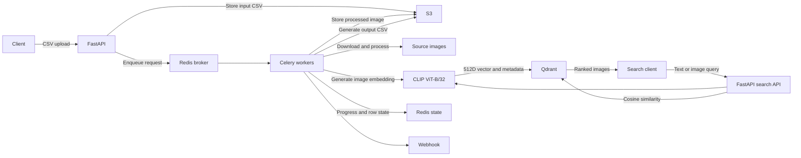

# Multimodal Image Processing and Search System

A FastAPI service that processes image URLs from CSV uploads using Celery, stores processed images in Amazon S3, generates CLIP embeddings, and indexes them in Qdrant for semantic and visual search.

The original asynchronous processing service was containerized and deployed using Docker, Amazon ECR, and Amazon ECS. The multimodal CLIP/Qdrant extension has been implemented and validated locally; redeployment of the AI-enabled version is pending.

## Features

- Asynchronous CSV processing with Celery and Redis
- Parallel image processing with Celery `group` and `chord`
- Ordered CSV output generation followed by webhook notification using `chain`
- Retry-safe Redis progress tracking using an atomic Lua script
- CLIP ViT-B/32 image and text embeddings with 512 dimensions
- Qdrant vector indexing with deterministic, idempotent point IDs
- Semantic text-to-image search
- Visual image-to-image similarity search
- CLIP-based near-duplicate detection with a configurable threshold
- Amazon S3 storage and presigned output CSV downloads
- Named Celery queues for orchestration, image processing, CSV generation, and webhooks

## Architecture



## Processing Flow

1. `POST /upload-csv/` validates and stores the input CSV in S3.
2. `process_csv` reads each row and creates one `compress_image` signature per image.
3. A Celery `group` runs image tasks in parallel, while a `chord` waits for every image task to succeed.
4. Each image task stores the processed image in S3, creates a normalized CLIP embedding, and upserts it into Qdrant.
5. Redis tracks request, row, and image progress atomically. Deterministic S3 keys and Qdrant point IDs make retries idempotent.
6. The chord callback starts a Celery `chain` that generates the ordered output CSV and then sends the webhook.

## Technology

- Python 3.9
- FastAPI and Pydantic
- Celery and Redis
- PyTorch and Hugging Face Transformers
- OpenAI CLIP ViT-B/32
- Qdrant
- Pillow
- Amazon S3, ECR, and ECS
- Docker

## Configuration

Create `.env` from `.env.example` and configure the required services:

```env
REDIS_URL=redis://localhost:6379/0
AWS_ACCESS_KEY=
AWS_SECRET_KEY=
AWS_BUCKET_NAME=
AWS_REGION=
CLOUDINARY_FETCH_URL=
REQUEST_TTL_SECONDS=604800

QDRANT_URL=
QDRANT_API_KEY=
QDRANT_LOCAL_PATH=./data/qdrant
QDRANT_COLLECTION=image_embeddings_clip_v1

CLIP_MODEL_NAME=openai/clip-vit-base-patch32
CLIP_DEVICE=cpu
```

Use either `QDRANT_URL` or `QDRANT_LOCAL_PATH`, never both. Embedded local storage is useful for single-process scripts and tests. FastAPI and Celery run as separate processes, so a shared Qdrant server should be configured through `QDRANT_URL` for the complete application.

`CLIP_DEVICE=cpu` works without a GPU. Use `cuda` only with a compatible NVIDIA GPU, drivers, and CUDA-enabled PyTorch installation. Model weights are downloaded from Hugging Face on the first inference and then cached locally.

## Installation

```bash
python -m venv .venv
```

Activate the environment and install dependencies:

```bash
pip install -r requirements.txt
```

The complete application also requires reachable Redis, S3, Cloudinary, and Qdrant services.

## Running

Start FastAPI:

```bash
uvicorn app.main:app --host 0.0.0.0 --port 8000 --reload
```

Start a Celery worker that consumes all declared queues:

```bash
celery -A app.celery_worker.celery worker --loglevel=info
```

Workers can be isolated by queue when scaling individual workloads:

```bash
celery -A app.celery_worker.celery worker -Q image_processing --loglevel=info
```

## CSV Format

The first three columns must use this header order:

```csv
Sr. No,Product Name,Input Image URLs
1,Red Shoes,https://example.com/red-shoes.jpg
2,Blue Shirt,https://example.com/blue-shirt.png
```

The service accepts at most 1,000 rows and 10 image URLs per row.

## API

### Upload CSV

```bash
curl -X POST http://localhost:8000/upload-csv/ \
  -F "file=@products.csv" \
  -F "webhook_url=https://client.example/webhook"
```

### Request Status

```bash
curl http://localhost:8000/status/REQUEST_ID
```

### Download Output CSV

```bash
curl -OJ http://localhost:8000/download/REQUEST_ID
```

### Semantic Text Search

```bash
curl "http://localhost:8000/api/v1/images/search?q=golden%20retriever&limit=10"
```

The query is encoded with CLIP's text encoder and compared with indexed image vectors using cosine similarity.

### Visual Similarity Search

```bash
curl -X POST "http://localhost:8000/api/v1/images/search-by-image?limit=10" \
  -F "file=@query.jpg"
```

JPEG, PNG, and WebP files are supported. Query uploads are validated, embedded, searched, and discarded; they are not stored in S3 or Qdrant.

### Near-Duplicate Detection

```bash
curl -X POST "http://localhost:8000/api/v1/images/detect-duplicates?threshold=0.95" \
  -F "file=@query.jpg"
```

The endpoint returns `is_duplicate=true` when Qdrant finds at least one image at or above the requested cosine threshold. The accepted threshold range is `0.80` to `1.00`.

## Testing

Run the offline test suite:

```bash
python -m unittest discover -s tests -v
```

Run real CLIP image/text inference:

```bash
python -m scripts.clip_smoke_test
```

Run real visual search and duplicate detection with disk-backed local Qdrant:

```bash
python -m scripts.visual_search_smoke_test
```

The visual smoke test indexes a red circle, blue square, and green triangle. A modified red-circle query is expected to rank the red circle first and exceed the duplicate threshold. Local vectors are written to `data/qdrant`, which is excluded from Git.

## Reliability and Scaling

- Celery tasks use exponential backoff, jitter, late acknowledgements, and worker-loss rejection.
- A Redis Lua script atomically marks each image and row complete once, including during retries.
- Qdrant point IDs are derived from request, row, and image indexes, so retried upserts replace the same record.
- Task routing allows orchestration, image inference, CSV generation, and webhook workloads to scale independently.
- CLIP is loaded lazily and cached once per FastAPI or Celery worker process.

## Current Limitations

- The CLIP/Qdrant version has been validated locally but has not yet been redeployed to ECS.
- Near-duplicate detection currently uses CLIP similarity only. Perceptual hashing can be added for stricter verification.
- Search is global because authentication and tenant-level Qdrant filtering are not implemented.
- The complete CSV-to-S3-to-Celery-to-Qdrant flow still requires validation against configured cloud infrastructure.
- Local CPU inference is suitable for development but may require dedicated workers, batching, or GPU inference at higher traffic.
